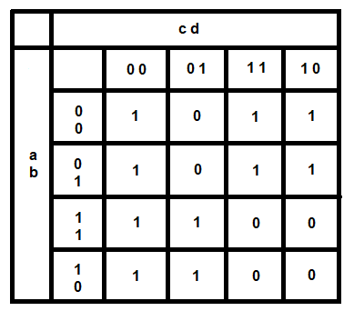

library IEEE;
use IEEE.std_logic_1164.all;

# D0011E - Laboration 2 (Design and verification of logic circuits in VHDL)
The goal of this lab is to implement simple logic in VHDL and to verify your own designs using simulations.

## Notes for online lab submission
It is important that you make sure that all the questions in the lab specification has been answered in your README (this file). You don't have to use the same structure as we've created, but if you change it make it clear. **Make sure that you have pushed all the code you have written to the repo. Just because there is not a question about a part does not mean it is not needed to pass the lab.** If you want you can push the entire vivado project.

## Preparation (to be completed BEFORE the practical lab session):

Complement the truth table from lab 1 with the function `hieq3: 1 if (x>=3) and (x<=9), 0 otherwise`.  Add the value of `hieq3` in the table below.

|  Input | max | min | even | lo3 | noBCD | hieq3 |
|:------:|:---:|:---:|:----:|:---:|:-----:|:-----:|
|    0   |  0  |  1  |   1  |  1  |   0   |   0   |
|    1   |  0  |  0  |   0  |  1  |   0   |   0   |
|    2   |  0  |  0  |   1  |  1  |   0   |   0   |
|    3   |  0  |  0  |   0  |  0  |   0   |   1   |
|    4   |  0  |  0  |   1  |  0  |   0   |   1   |
|    5   |  0  |  0  |   0  |  0  |   0   |   1   |
|    6   |  0  |  0  |   1  |  0  |   0   |   1   |
|    7   |  0  |  0  |   0  |  0  |   0   |   1   |
|    8   |  0  |  0  |   1  |  0  |   0   |   1   |
|    9   |  1  |  0  |   0  |  0  |   0   |   1   |
| 10 (A) |  0  |  0  |   1  |  0  |   1   |   0   |
| 11 (B) |  0  |  0  |   0  |  0  |   1   |   0   |
| 12 (C) |  0  |  0  |   1  |  0  |   1   |   0   |
| 13 (D) |  0  |  0  |   0  |  0  |   1   |   0   |
| 14 (E) |  0  |  0  |   1  |  0  |   1   |   0   |
| 15 (F) |  0  |  0  |   0  |  0  |   1   |   0   |

Obtain the Boolean equation for the new signal `hieq3` as a function of the inputs `x0`, `x1`, `x2`, `x3`. You will have to introduce the equation into the answer for Question 1, in the last part of the lab.

## Part 1
**a)** Modify `bcdcheck2.vhd` from lab 1 by adding the output `hieq3`, determined directly from the input signals. Change the entity name to `bcdcheck3`. Save your code as `bcdcheck3.vhd` and add it to the project using the menu Project > Add Copy of Source... (if you saved the file outside the project directory) or Project > Add Source (if you saved the file inside the project directory).

Verify your design using the pre-defined tests in the `test_bench.vhd`.
Now you can answer Question 2 at the end of the lab. Below you can see the component definition of `bcdcheck3`.

```vhdl
entity bcdcheck3 is 
	port(x : in std_logic_vector(3 downto 0));
        max, min, even, lo3, noBCD, hieq3 : out std_logic
    );
end entity;
```


**b)** A problem with the solution in 1a is an unnecessary duplication of comparators, you can see the circuit in “Open Elaborated Design”. To avoid this, modify `bcdcheck3.vhd` so that `hieq3` is determined by reusing the comparators from the calculations of `lo3` and `noBCD`. Change the entity name to `bcdcheck4` and save your code as `bcdcheck4.vhd`. Simulate and verify your design, make sure to test all possible inputs. To check that you have reused the comparator, reload the “Open Elaborated Design”.

*Hint:* Since you cannot read output signals in VHDL, you will need to introduce intermediate signals `lo3_int` and `noBCD_int` (internal to the architecture of BCDcheck4) and then use them to assign the output signals `hieq3`, `lo3`, and `noBCD`. If you see more comparators than before, try using the code as in `bcdcheck1.vhd` and use a NOR gate instead. This will require you to change the entity definition of `bcdcheck4` and change its input in the test bench. Below you can see the component definition of `bcdcheck4` if you used `bcdcheck3` as a starting point.

```vhdl
entity bcdcheck4 is 
	port(x : in std_logic_vector(3 downto 0));
        max, min, even, lo3, noBCD, hieq3 : out std_logic
    );
end entity;
```

In this solution you removed comparators but added other logic gates. At the end the RTL schematic does not show much savings in space. Was it then a good decision to remove the comparator? Answer the corresponding questions in part 5 of the lab.

**c)** Try to move the assignment of hieq3 by placing it above and below the assignments of the intermediate signals `lo3_int` and `noBCD_int`. Simulate your design. Does this change affect the behavior of the entity, i.e. does the order of assignments in VHDL matter? Answer to Question 5 at the end of the lab.

## Part 2
**a)** Design a VHDL component that corresponds to the logic function `f = bc'd' + a'd' + ac' + a'c` (without making any optimizations). Generate RTL schematic. Then perform the synthesis of your design and open the synthesized schematic to compare. Has the synthesis tool optimized the design? How? Answer to Question 6 at the end of the lab. Below you can see the component definition of `part2a`.

```vhdl
entity part2a is 
	port(a, b, c, d : in std_logic;
        f : out std_logic
    );
end entity;
```

**b)** Verify your design by comparing the simulation results to the truth table. Write your results in Question 7 at the end of the lab.

## Part 3
When designing hardware, we often need to express certain logic using a grid of PLD cells (PLD = programmable logic device). In this assignment, you will express the function f from 2a using the following PLD cell:


**a)** Write a VHDL component corresponding to the schematic of the PLD cell above. Use this interface:

```vhdl
entity PLDcell is
    port(
        x5, x4, x3, x2, x1, x0, inv : in STD_LOGIC;
        y : out std_logic);
end PLDcell;
```

**b)** Design a VHDL component for the logic function `f = bc'd' + a'd' + ac' + a'c` that uses a single PLD cell from 3a and no other logical circuits. You may, however, invert the input signals `(a,b,c,d)` before sending them to the PLD cell or set its inputs to constants `0` or `1`. Add and test your `PLDcell` in `test_bench.vhd` (add `asserts`).

*Hint:* you will need to perform Karnaugh minimization of the function `f`.

**c)** Design a VHDL component for the logic function `g = a'b'c' + abcde` that uses two PLD cells from  3a. You may invert the input signals `(a,b,c,d,e)` before sending them to the PLD cell or set its inputs to constants `(0,1)`. You may also send the output from one cell as an input to another cell. Add your component to the test bench. Simulate and verify your design by adding `asserts`. You should write enough tests to make sure that the component is correct. If you want to test all possible inputs it will result in 32 test cases.

## Part 4
Let `x = (x3, x2, x1, x0)` be a BCD encoding of a number from `0` to `9`. Design a VHDL component that takes `x3, x2, x1, x0` as inputs and produces `y3, y2, y1, y0` as outputs, where `y = (y3, y2, y1, y0) = 9 – x`, i.e. y is the 9-complement of `x`. Use exactly four PLD cells depicted below, one for each bit of `y`. You may not invert the input signals before sending them to the PLD cells but you may set their inputs to constants `0` or `1`. Add your design to the test bench and test it, the same way you have done the previous parts.


*Hint:* write 4-bit encodings for each value of x and the corresponding value of y. Use these to formulate separate logic functions for each bit of y, using only x1, x2, x3, and x4 as inputs. You should also use the fact that x can only be a number from 0 to 9, i.e. not all combinations of bits are possible as inputs.

## Part 5

### Question 1
What is the boolean equation for heiq3?

hieq3 = (x(3) * x(2)' * x(1)') + (x(3)' * x(2)) + (x(3)' * x(2)' * x(1) * x(0))

### Question 2
After modifying `bcdcheck2.vhd` and the corresponding test bench, answer the following questions:
What types of signals are predfined in VHDL?

Bit, integer and boolean.

What are the differences between an Integer and a std_logic in VHDL?

An integer can be any whole number, while std_logic is a signal. So for instance std_logic could be 1 or 0 which is it's most basic form, or it could be one of the following signals: 
Z (High impedance), W (Weak signal, can’t tell if 0 or 1), L (Weak 0, pulldown), H (Weak 1, pullup), - (Don’t care), U (Uninitialized), or X (Unknown, multiple drivers).

### Question 3
After creating `bcdcheck3.vhd` to use intermediate signals, compare `bcdcheck3.vhd` and `bcdcheck4.vhd` RTL schema. What are the differences and why do we want to you use intermediate signals?

The difference is that there are less operations, and because it has less operations it will run faster.

### Question 4
When you reused the comparators you had to add other logic gates. Then, was it a good decision to remove the comparators?

Yes, because although we had to add other logic gates, we reduced the total amount of logic gates that we have which led to better performance.

### Question 5
Try to change the order of code by moving hieq3 above the assignment of the signals. Does this change the behaviour?

No.

### Question 6
After implementing and testing part 2a) in the lab specification, has the synthesis tool optimized the design in some way? How?

Yes, the design was changed. It appears that it has removed the unnecessary logic gates and it removed one input.

### Question 7
Create a truth table for `f`, as defined in the lab specification part 2a), and verify the design by comparing the truth table from the Preparation.

|  Input |  f  |
|:------:|:---:|
|    0   |  1  |
|    1   |  0  |
|    2   |  1  |
|    3   |  1  |
|    4   |  1  |
|    5   |  0  |
|    6   |  1  |
|    7   |  1  |
|    8   |  1  |
|    9   |  1  |
| 10 (A) |  0  |
| 11 (B) |  0  |
| 12 (C) |  1  |
| 13 (D) |  1  |
| 14 (E) |  0  |
| 15 (F) |  0  |

### Question 8
Show how you have minimized `f` to "fit" into the PLD cell you have implemented. Either you perform Karnaugh minimization or use boolean algebra.



Create a equeation that coresponds with where the value is 0 to get the inverse function; f = (a'c'd)+(ac).

### Question 9
Show the boolean equations for `x3`, `x2`, `x1`, `x0` for part 4. How did you get to these boolean expressions? How did you assure yourself that these are correct?

Truth table for the outputs of y:

| x3 | x2 | x1 | x0 | y3 | y2 | y1 | y0 |
|:--:|:--:|:--:|:--:|:--:|:--:|:--:|:--:|
|  0 |  0 |  0 |  0 |  1 |  0 |  0 |  1 |
|  0 |  0 |  0 |  1 |  1 |  0 |  0 |  0 |
|  0 |  0 |  1 |  0 |  0 |  1 |  1 |  1 |
|  0 |  0 |  1 |  1 |  0 |  1 |  1 |  0 |
|  0 |  1 |  0 |  0 |  0 |  1 |  0 |  1 |
|  0 |  1 |  0 |  1 |  0 |  1 |  0 |  0 |
|  0 |  1 |  1 |  0 |  0 |  0 |  1 |  1 |
|  0 |  1 |  1 |  1 |  0 |  0 |  0 |  1 |
|  1 |  0 |  0 |  0 |  0 |  0 |  0 |  0 |
|  1 |  0 |  0 |  1 |  0 |  0 |  0 |  0 |

Equations for each value of y was formulated with the help of this truth table:

y0 = x0'

y1 = x1

y2 = x2' x1 + x2 x1'

y3 = x3' x2' x1'

<<<<<<< HEAD
The simulation also shows this result which means that is is correct.
=======
The simulation also shows this result which means that is is correct.
>>>>>>> e0251253307895e570885bf17fe08139b4e3a867
