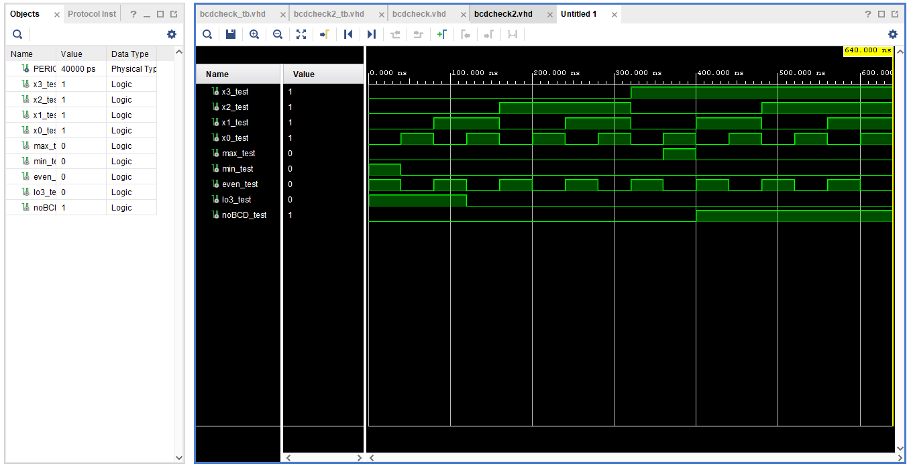
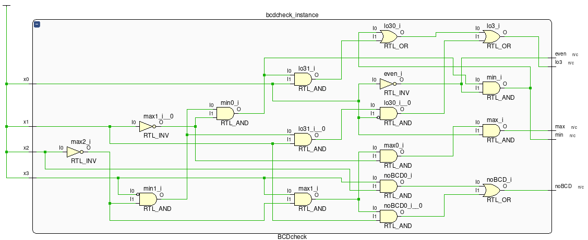
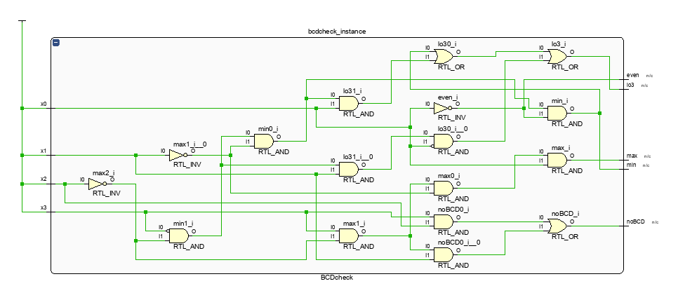
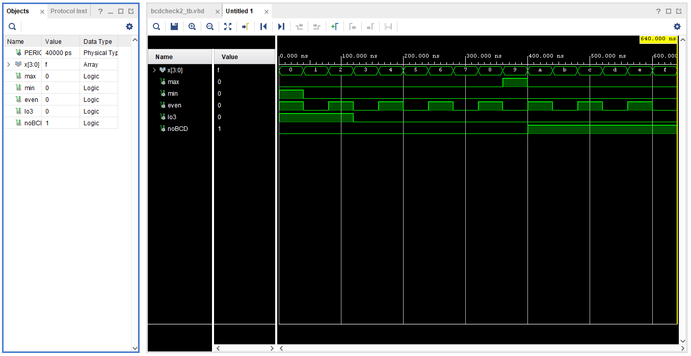
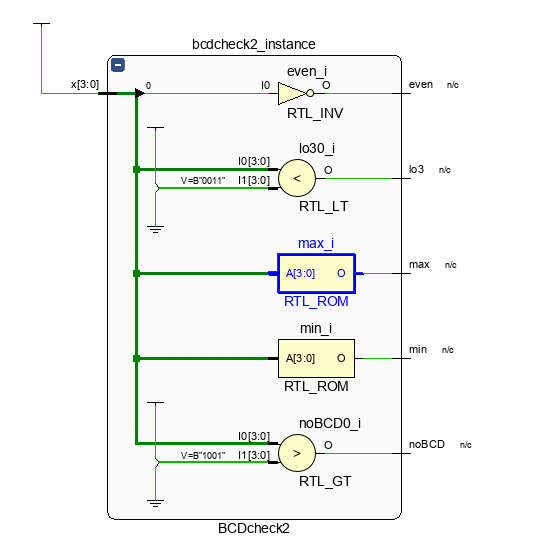

# D0011E - Laboratory Exercise 1

The goal of this lab is for you to get acquainted with basic VHDL syntax and to start using Xilinx Vivado, which will be used in the course for generation of RTL (register-transfer level) schematic and simulation of VHDL code.

You should be able to complete the lab during the first labsession. You can commit the whole Vivado project to facilitate reviewers in their task. The README file (this file) includes the table of the preparation and the answers to the questions in this document,include the text and the index of the question for it to be traced.jag

## Preparation (to be completed BEFORE the labsession):

Start by reviewing introduction to VHDL (slides from a lecture available in Canvas).

Fork this repository, and clone it to your computer.

Study the source files `bcdcheck.vhd` and `bcdcheck2.vhd` with two implementations of a 4-bit BCD checker (BCD stands for binary-coded decimal,see http://en.wikipedia.org/wiki/Binary-coded_decimal).

Note that the inputs `x0`, `x1`, `x2`, and `x3` represent bits 0 (least significant) to 3 (most significant) of the 4-bit encoding.

### Question 1

Review `bcdcheck2.vhd`. Based on your understanding of the code, what will the (Boolean) output of each signal be given a specific input? Fill in the table below.

| Input  |  max  |  min  | even  |  lo3  | noBCD |
| :----: | :---: | :---: | :---: | :---: | :---: |
|   0    |   0   |   1   |   1   |   1   |   0   |
|   1    |   0   |   0   |   0   |   1   |   0   |
|   2    |   0   |   0   |   1   |   1   |   0   |
|   3    |   0   |   0   |   0   |   0   |   0   |
|   4    |   0   |   0   |   1   |   0   |   0   |
|   5    |   0   |   0   |   0   |   0   |   0   |
|   6    |   0   |   0   |   1   |   0   |   0   |
|   7    |   0   |   0   |   0   |   0   |   0   |
|   8    |   0   |   0   |   1   |   0   |   0   |
|   9    |   1   |   0   |   0   |   0   |   0   |
| 10 (A) |   0   |   0   |   1   |   0   |   1   |
| 11 (B) |   0   |   0   |   0   |   0   |   1   |
| 12 (C) |   0   |   0   |   1   |   0   |   1   |
| 13 (D) |   0   |   0   |   0   |   0   |   1   |
| 14 (E) |   0   |   0   |   1   |   0   |   1   |
| 15 (F) |   0   |   0   |   0   |   0   |   1   |

In the README file include the Boolean algebra equations for each variable of the truth table, with the same name as the columns and as a function of the inputs `x0`, `x1`, `x2`, and `x3`.

max = x3 * x2' * x1' * x0

min = x3' * x2' * x1' * x0'

even = x0'

lo3 = (x3' * x2' * x1' * x0') + (x3' * x2' * x1' * x0) + (x3' * x2' * x1 * x0')

noBCD = (x3 * x2) + (x3 * x2' * x1)


Also study the source files `bcdcheck_tb.vhd` and `bcdcheck2_tb.vhd`. These will be used to verify the implementations of BCDchecker in simulation.

---

## Part 1 - Starting up a Xilinx Vivado project

1) Start `Vivado 2020.2`.
  
2) `Quick Start`. From `Quick Start` choose `Create Project`. Press `Next`, enter `lab1` as your `Project name` and the path to your folder for this lab as your `Project location`. (In my case it is `/home/pln/courses/d0011e/d0011e_lab1`.) Uncheck the `Create project subdirectory`, this is important for the Contineous Integration scripts to work.

3) `Project Type`. Leave the default setting `RTL Project` and click `Next`.

4) `Add Sources`. Click `Add Files` and chose add the source files from the `code` folder, then click `Next`.

5) `Add Constraints`. We don't have any constraints so skip this by pressing `Next`.

6) `Default Part`. Enter `xc7a35tcsg324-1` in the search field and select the found part, then click `Next`.

7) If things went well, you should have a `New Project Summary` reflecting the above made choices, click `Finish` to continue.

8) Vivado will automatically associate identify the two test-benches (`bcdcheck_tb.vhd` and `bcdcheck2_tb.vdh`) and associate those to their respective instances to test (declared in `bcdcheck.vdh` and `bcdcheck2.vhd` respectively).

9) Select `bcdcheck_tb` as the top module. (Right click on the file under `Simulation Sources`, and select `Top Module`).

10) Click `Run Simulation` (found under `Flow Navigator`/`SIMULATION`). Select `Run Behavioral Simulation`. It will first elaborate the design (compile the VHDL code) then open a `SIMULATION` view/pane.

11) In the simulation view, click `Zoom Fit`, to view the signal waveforms. Familiarize yourself with the simulation tool, scrolling, zooming. Double clicking a signal in the `Object` view will open the the test-bench `bcdcheck_tb.vhd` and highlight the signal declaration.

12) Open the corresponding test-bench, and place a breakpoint at the last `wait for PERIOD`. Restart the simulation (`Restart` button is found above the `SIMULATION` pane, or press `CTRL-SHIFT-F5`). Now run the simulation until the breakpoint is hit, (`Run All` button, or press `F3`). You can now toggle back to the waveform view to see the simulation up to this point. You can split the view so you can have both the test-bench and waveform displayed simultaneously. Play around with breakpoints to make yourself familiar.

Note that “Run All” will run a simulation until paused if no breakpoint is set. Later when we are going to run simulations in the "cloud" there is no-one there to press the "pause", so it would run forever (which is not what we typically want.) You may also run simulation for a predefined time `Run For Xus` button (`SHIFT F2`), where `X` can be set in the accompanying field.

By default,only signals declared in the top-level entity (in ourc ase, `bcdcheck_tb`) are shown in the wave window. However, you can add internal signals of components (e.g. `bcdcheck_instance`) by selecting a component in the `Scope` panel and dragging signals from the `Objects` panel to the wave window.

To avoid ambiguity between signal names, we use `_test` to indicate that a signal stems from the test bench.

---

## Part 2. Verifying the BCDchecker

Use the table you prepared earlier and verify that for each tested input, that all the output signals of `bcdcheck` are correct.

### Question 2

1) Make screen shot of the wave window. Make sure that the simulation screenshot captures the whole simulation. Store the screenshot in the `images` folder.



2) Explain why these values of the output signals are correct (it is not sufficient to refer to the truth table alone, you need to refer to the VHDL code here). Hint, look at how the algebraic expressions are encoded in VHDL for each signal.

max: According to the code, max is 1 when x3 = 1, x2 = 0, x1 = 0, and x0 = 1, which is what we see in the graph.

min: According to the code, min is 1 when all the values on x equal 0, which is what we see in the graph.

even: According to the code, even is 1 when x0 = 0, which is what we see in the graph.

lo3: According to the code, lo3 is 1 when all the values of x are 0 or when all the values of x are 0 except x0 or x1, which is what we see in the graph.

noBCD: According to the code, noBCD is 1 when all the values of x are 1 or when x3 is 1 and x2, x1, and x0 are 1 except for one of them (excluding x3) or when x3 and x2 are 1 and x1 and x0 are 0, which is what we see in the graph.

---

## Part 3. Generating the RTL schematic

Leave the default elaboration settings in the `RTL analysis` and generate the schematic by clicking on “OpenElaboratedDesign”. Once finished, the schematic of `bcdcheck` design is displayed. It should look something like this.



### Question 3

Make a screenshot of your circuit elaboration:



---

## Part 4. `bcdcheck2.vhd`

Repeat Part2 and part3 to verify and implement BCDcheck2. This time, set `bcdcheck2_tb` should be set as top module for both design and simulation. (You need to re-run simulation and `Reload` elaboration.)

### Question 4

1) Explain in your own words the main difference between `bcdcheck` and `bcdcheck2`.

There are two main differences between bcdcheck.vhd and bcdcheck2.vhd. Firstly, bcdcheck uses binary numbers to determine the output values while bcdcheck2 uses vectors to determine the values. Secondly, bcdcheck uses boolean algebra equations to determine their value while bcdcheck2 uses "programming" boolean expression.

2) Now review `bcdcheck2.vhd`. Based on your understanding of the code, what will the boolean equation be for each and every output?

max = x(3) * x(2)' * x(1)' * x(0)

min = x(3)' * x(2)' * x(1)' * x(0)'

even = x(0)'

lo3 = (x(3)' * x(2)' * x(1)' * x(0)') + (x(3)' * x(2)' * x(1)' * x(0)) + (x(3)' * x(2)' * x(1) * x(0)')

noBCD = (x(3) * x(2)) + (x(3) * x(2)' * x(1))


3) Make screen shot of the wave window. Make sure that the simulation screenshot captures the whole simulation. Store the screenshot in the `images` folder.



4) Explain why these values of the output signals are correct (it is not sufficient to refer to the truth table alone, you need to refer to the VHDL code here). Hint, look at how the algebraic expressions are encoded in VHDL for each signal.

max: According to the code, max is 1 when x(3) = 1, x(2) = 0, x(1) = 0, and x(0) = 1, which is what we see in the graph.

min: According to the code, min is 1 when x(3) = 0, x(2) = 0, x(1) = 0, and x(0) = 0, which is what we see in the graph.

even: According to the code, even is 1 when x(0) = 0, which is what we see in the graph.

lo3: According to the code, lo3 is 1 when x(3), x(2), x(1), and x(0) are 0 or when x(3), x(2), x(1) and x(0) are 0 except for x(1) or x(0), which is what we see in the graph.

noBCD: According to the code, noBCD is 1 when x(3), x(2), x(1), and x(0) are 1 or when x(3) is 1 and x(2), x(1), and x(0) are 1 except for one of them (excluding x(3)) or when x(3) and x(2) are 1 and x(1) and x(0) are 0, which is what we see in the graph.

5) Make a screenshot of your circuit elaboration:



You should find that the design in captured by high level blocks instead of primitive gates.

---

### Part 5. Test benches

Waveforms are great to get a graphical view on the signals to verify that the design is correct. However, think of systems with thousands (or even millions) of signals (like in a full scale Processor). Obviously it will be very hard to validate by looking at the wave form. Instead we automate the process. Look at the `bcdcheck2_tb`:

``` vhdl
    x <= "0000";
    wait for PERIOD;
    assert max = '0' and min = '1' and even = '1' and lo3 = '1' and noBCD = '1' report "Error: Input value 0000" severity error;
```

The assertion is checked after we set `x <= "0000"` and the `wait for PERIOD` (allowing the signals to propagate).

The `vivado` tools can be run directly from terminal.

``` shell
> cd <to_the_local_folder_you_have_cloned_your_repository>
> ./ci_scripts/run.sh
```

The `cd <to_the_local_folder_you_have_cloned_your_repository>`, sets your current working directory (in my case it is `/home/pln/courses/d0011e/d0011e_lab1`, but depending where you "cloned" the lab it may vary of course).

The `./ci_scripts/run.sh` launches the run script (found in the `ci_scripts` folder). If this fails you may need to set the file type to executable `chmod +x ci_scripts/*`.

It takes a while for the script to run (30 seconds on my machine), the result should look like this.

``` shell
Error: Error: Input value 0000
Time: 40 ns  Iteration: 0  Process: /bcdcheck2_tb/line__25  File: /home/pln/courses/d0011e/d0011e_lab1/sim/xsim/srcs/bcdcheck2_tb.vhd
## quit
INFO: [Common 17-206] Exiting xsim at Mon Mar 29 11:57:33 2021...
====================================
==========  OH NO !!!!  ============
====================================
```

So the assertion failed. Why? Let's have a look at the `assertion` and compare that to the first row of your truth table (Question 1). You should see that I (intentionally) made a mistake. Fix the bug in the assertion statement and re-run the script.

You should now get:

``` shell
## run -all
## quit
INFO: [Common 17-206] Exiting xsim at Mon Mar 29 12:07:29 2021...
====================================
=============  OK !!  ==============
====================================
```

### Question 5

Now extend the test bench with one assertion per test (assignment of `x`). So there should be 16 assertions according to your truth table in Question 1.

Re-run the script. If you find that some tests fail, you most likely have an error in the assertion. Make sure all test pass, and that the script produces an `OK !!` message.

Think of possible advantages of automated tests, and explain in your own words why test automation is a must.

Simply put, the most obvious advantage is time. It allows us to go through many tests in a short period of time, and ofcourse the programmer wouldn't have to go through all the tests manually.

## Final remarks

Now you have learned to use vivado and taken the first steps towards design validation by writing your own tests/assertions.

Now add all changed files to your repository.

``` shell
> git status
...
Changes not staged for commit:
  (use "git add <file>..." to update what will be committed)
  (use "git restore <file>..." to discard changes in working directory)
        modified:   README.md
        modified:   code/bcdcheck2_tb.vhd
...
Untracked files:
  (use "git add <file>..." to include in what will be committed)
        .Xil/
...

```

You will find some files marked as modified, others as un-tracked.

``` shell
> git add <file>
```

Adds the file (and tracks it if not already tracked). Use this to add the `README.md`, `code/bcdcheck2_tb.vhd`, `lab1.xpr`, and the folder `images`.

``` shell
> git commit -m "my awesome lab1"
> git push
```

First you commit the files (locally), and then push the commit to the upstream repository (on the vesuvio gitlab server).
