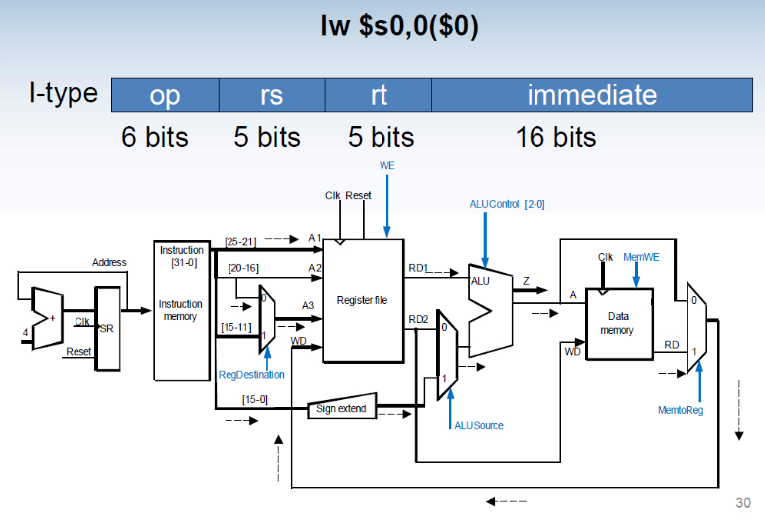
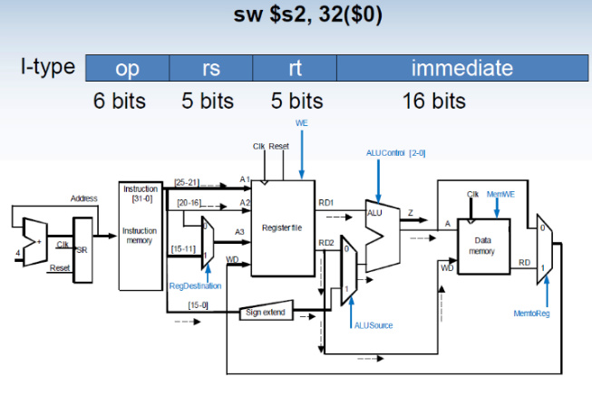
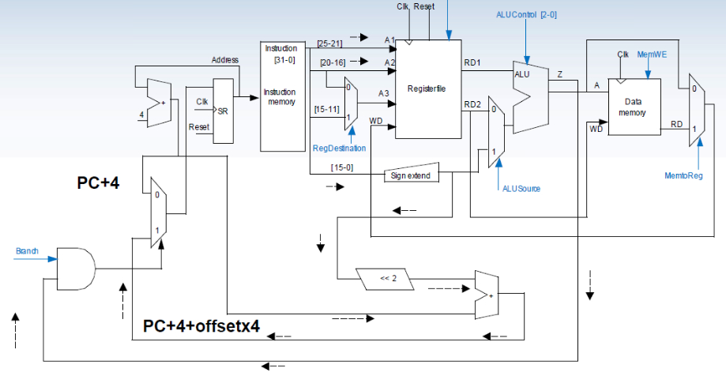
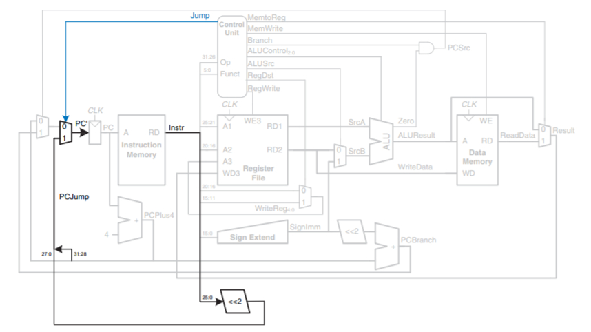

# D0011E Lab 5 (The improved MIPS version)
The goal of this lab is to implement a data memory for the simplified 32-bit MIPS processor from Lab 4 and add support for the following instructions:
- ``lw`` and ``sw``
- ``beq`` and ``Jump`` to target

It is recommended that this lab is completed in groups of two.
This lab is based on Lab 4, so you should start by importing the VHDL code from lab 4 into the given project. You do not have to import the regfile as a new one was given to you.

## Preperation
Study full 32-bit MIPS in the lecture 10 slides. Answer the questions below.

**Q1.** Explain how the ``lw`` and ``sw`` instructions will work and show the active paths during each instruction.  You can add an image to help you answer the question.  

lw - lw stands for "load word". The lw instruction loads data from a memory location (our DataMemory) into a register (our RegisterFile). The control unit controls the word, that is if the word is sent to register file or not, that is achived by setting the MemtoReg to 1 or 0, where if it is 1 it sends it, and the RegDestination is used to set the store adress in the register file.
The active path during the lw instruction:



sw - sw stands for "store word". The sw instruction stores data in a register (our RegisterFile) at the memory location (our DataMemory). The control unit controls the word, that is if the word is stored in the register file or not, that is achived by setting the MemtoReg to 1 or 0, where if it is 1 it sends it, and the RegDestination is used to set the store adress in the register file.
The active path during the sw instruction:



**Q2.** Similarly explain how the ``beq`` instruction will work and show the active paths during its execution.  You can add an image to help you answer the question.  

The beq instruction reads the two registers rs and rt and then compares them by using the ALU substraction to see if they are equals. If the two registers are equal, an 18 bit signed value will be given to the program counter.
The active path during the beq instruction:



**Q3.** Why should the main ALU not be used for the ``beq`` computation?
Because the process is a single cycle, so a new ALU would be needed for every calculation.
--- 

To improve the architecture further and for better use of the processor, it is important that the jump instruction is supported. This will allow for larger jumps which increases the flexibility of the processor.

One of the unconditional jump instructions MIPS uses, is ``J target`` (Jump to target). This J-type instruction consists of an opcode of 6 bits (000010) and an address, which is an absolute value (0, 1, 2, 3, ..., N) and occupies 26 bits in the instruction space. We know that MIPS uses word aligned instructions (4-byte instruction). You can find the implementation of ``J target`` instruction in chapter 7 of course book. You should use the last four bits of the current PC+4 as part of the target address. This will only be valid if the jumping range is not affected by these four bits. It is important you understand how this will function within your MIPS design. Refer to the book & the lecture slides to answer the questions below.

**Q4.** Explain how the ``J`` instruction will work and show the active paths during its execution. You can add an image to help you answer the question.

The op code sends out a true/1 jump instruction that consists of a 26 bit address, where the first 6 bits are the opcode and the remaining bits are used to specify an adress, this jump instruction is sent from control unit and the address gets left shifted by two steps and is then used to select the next instruction.



**Q5.** How far is it possible to jump within a program using ``J`` and ``beq`` respectively?

 beq supports 2^(15)-1 forwards and 2^(15) backwards. 2^16  in total, and that gives 2^(15)-1 forward and 2^(15) backwards.
---

Complement the instruction decoder table from quiz 2 with 4 new signals for ``lw``, ``sw``, ``beq`` and ``J-instructions``. That is, the signals missing in the table below needed to provide the needed control for the new instructions. _(Signal names should match your design)_

| Instruction | Opcode | funct  | WE | ALUControl | RegDestination | ALUSource | MemWe | MemToReg | Brach | Jump |
|:-----------:|:------:|:------:|:--:|:----------:|:--------------:|:---------:|:-----:|:--------:|:-----:|:----:|
|     ADD     | 000000 | 100000 | 1  |    010     |       1        |     0     |   0   |    0     |   0   |   0  |
|     ADDI    | 001000 | ------ | 1  |    010     |       0        |     1     |   0   |    0     |   0   |   0  |
|     SUB     | 000000 | 100010 | 1  |    110     |       1        |     0     |   0   |    0     |   0   |   0  |
|     SLT     | 000000 | 101010 | 1  |    111     |       1        |     0     |   0   |    0     |   0   |   0  |
|     SLTI    | 001010 | ------ | 1  |    111     |       0        |     1     |   0   |    0     |   0   |   0  |
|     AND     | 000000 | 100100 | 1  |    000     |       1        |     0     |   0   |    0     |   0   |   0  |
|     OR      | 000000 | 100101 | 1  |    001     |       1        |     0     |   0   |    0     |   0   |   0  |
|     LW      | 100011 | ------ | 1  |    010     |       0        |     1     |   0   |    1     |   0   |   0  |
|     SW      | 101011 | ------ | 0  |    010     |       X        |     1     |   1   |    X     |   0   |   0  |
|     BEQ     | 000100 | ------ | 0  |    110     |       X        |     0     |   0   |    X     |   1   |   0  |
|     JUMP    | 000010 | ------ | 0  |    xxx     |       X        |     X     |   0   |    X     |   X   |   1  |

The values of the opcode and funct fields can be found in the MIPS green Card.

--- 

Using the supported instructions only, write an assembly program that divides two positive integers ``N`` (Numerator) and ``D`` (Denominator). Store the results ``Q`` (Quotient) and ``R`` (Remainder) in any two registers. Write the machine code for it, you will need it for lab 5. Remember that ``N < D`` and ``N = D `` are valid inputs. ``N`` and ``D`` should go into ``$a0`` and ``$a1`` respectively. ``Q`` and ``R`` should go into ``$v0`` and ``$v1`` respectively. More information can be found: http://www.sm.luth.se/csee/courses/smd/D0013E/index.php?page=reg

Use repeated subtraction to perform the division. See the algorithm below. **https://en.wikipedia.org/wiki/Division_algorithm#Division_by_repeated_subtraction**

```
Q := 0 
R := N

while R ≥ D do 
    Q := Q + 1
    R := R − D
end
```

**Q6.** Write the MIPS assembly code for your program below:
```mips
addi $a0, $zero, N      # N.
addi $a1, $zero, D      # D.
addi $v0, $zero, 0      # Q.
addi $v1, $a0, 0        # R.
addi $t1, $zero, 1      # temp.

while:
    slt $t0, $v1, $a1   # If R < D set $t0 to 1, else to 0.
    beq $t0, $t1, exit  # If $t0 = $t1 jump to done, else continue.
    addi $v0, $v0, 1    # Add 1 to Q.
    sub $v1, $v1, $a1   # Subtract D from R.
    j while             # Go back to while.
exit

```

**Q7.** Write the machine code for your program below:
```mips
001000 00000 00100                        # N.
001000 00000 00101                        # D.
001000 00000 00010 0000 0000 0000 0000    # Q.
001000 00100 00011 0000 0000 0000 0000    # R.
001000 00000 01001 0000 0000 0000 0001    # temp.

000000 00011 00101 0100 0000 0010 1010    # If R < D set $t0 to 1, else to 0.
000100 01000 01001 0000 0000 0000 0011    # If $t0 = $t1 jump to done, else continue.
001000 00010 00010 0000 0000 0000 0001    # Add 1 to Q.
000000 00011 00101 0001 1000 0010 0010    # Subtract D from R.
000010 00000 00000 0000 0000 0000 0101    # Go back to while.

```

**Q8.** How many cycles are needed to the final result? Discuss.

The number of cycles depends on the size of D and N, the program will loop as long as R >= D.

**Q9.** Study the new regfile given to you. What are the main differences between the regfile from lab 4 and the one you will be using in lab 5?

There is no difference.


**Q10.** How can you leverage the debug statements to test internal signals of different components?

Debug signals can be used to see the output so that the input was correct.

**The knowledge from this preperation is needed in order to complete lab 5.**

## Part 1
Based on the ``RegFile.vhd`` given to you in lab 5, implement a data memory where data can be stored and fetched.

The memory should have the following interface:

```vhdl
entity DataMemory is 
port ( Clk: in std_logic;
        Reset: in std_logic;
        MemWE : in std_logic;
        Address : in std_logic_vector(31 downto 0);
        DataIn : in std_logic_vector(31 downto 0);
        DataOut : out std_logic_vector(31 downto 0);
        dbg_dm_reg : in std_logic_vector(4 downto 0);
        dbg_dm_reg_data : out std_logic_vector(31 downto 0)
    );
end entity;
```

Remember that:

- Data writing is synchronous with the clock
- Data is written at the rising edge of the clock and when MemWE is high
- Data reading is asynchronous; data of the memory location (Address) is sent out at DataOut when MemWE is low.
- Furthermore, make sure that the Address is in an accessible range.

You only need to support 32 words as memory space and you can assume that all accesses are word-aligned.

* Run a simulation with the given test bench to verify that the memory works as expected. Don't forget the assert statements.

**Q11:** Describe how you made sure that the address is in a accessible range and argue why this solution is good/correct.

To make sure that the address was in a accessible range only the last 5 bits from the address input were used. Since we are only using the last 5 bits of the adress, we will get 32 different adresses, this way it dosn't matter what the other bits are becouse we don't look at them.

**Put which inputs you tested here to make it easier for the reviewer to check your implementation**

## Part 2
Implement support for ``lw`` and ``sw`` instructions according to your design in the preperation part. 

Copy your ```FirstMipsVersion.vhd``` to a file called ```SecondMipsVersion.vhd```. Import ```SecondMipsVersion``` and modify it such that the entity is defiend as:

```vhdl
entity SecondMipsVersion is
  port(
    Clk : in std_logic;
    Reset : in std_logic;
    dbg_reg : in std_logic_vector(4 downto 0);
    dbg_reg_data : out std_logic_vector(31 downto 0);
    dbg_dm_reg : in std_logic_vector(4 downto 0);
    dbg_dm_reg_data : out std_logic_vector(31 downto 0)
  );
end SecondMipsVersion;
```

Where ```dbg_dm_reg``` and ```dbg_dm_reg_data``` are debug signals for the data memory, similarly to how you used debug signals for the register in lab 4. You will also need to import all the other components into the lab 5 project you used in lab 4, such as the ALU, PCPlus4, etc.

Import and modify the program memory content in ``Programmemory.vhd`` to include the following program:

```mips
addi r0, r1, -8  
addi r1, r2, 3  
add r2, r0, r1  
sub r3, r1, r0  
slt r4, r2, r3  
slti r4, r2, -9  
slt r4, r2, r3  
or r5, r4, r6  
and r6, r5, r1  
sw r2, 0(r7)  
lw r8, 0(r7)  
sw r3, 4(r9)  
lw r9, 4(r10)  
```

You only need to add the last four instructions to the old program.

* Run a simulation to verify that the program works as expected (i.e. that correct values are written to the register file and data memory). Take a screenshot and put it in the readme. Remember that no register values or data memory value should change after the program is done executing.
* Write unit tests to test that all registers contain the correct values once the program has finished executing.
* Do the same for the data memory.

## Part 3
Modify your MIPS to support ``beq`` and ``Jump to target``. Refer to the preperation to add all the necessary components and interconnections.

* Test your **full** control unit (which supports ``sw``, ``lw``, ``beq``, ``J``, ``add``, ``addi``, ``sub``, ``and``, ``andi`` ``or``, ``ori``, ``slt`` and ``slti``) in the given test bench. Don't forget assert statements. This means that you should initiate a new control unit and test it separately from the rest of the MIPS.

## Part 4
Test your design of the mips and program from the preperation to divide two integers ``N`` and ``D``.

* Run a simulation to verify that the program works as expected (i.e. that correct values are written to the register file). Comment out the old program from the program memory so its easier for the reviewers to re-run part 2.

## Part 5 Upload the Vivado project and the README file created during the lab, remember:
* Unit tests for the data memory, contol unit and reg file. 
* The full implementation of the MIPS, with the implementation of your divider. Verify that it works with the initial values:
  * N = 12, D = 5
  * N = 12, D = 12
  * N = 5, D = 12
* Answers to all the questions
* Screenshots of the result of the simulations for part 2, remember to show both the data memory and the register memory. To make it easy to read you can change the radix to signed decimal.

**Congratulations. You have made a general purpose processor that can be configured on a Field-programmable gate array (FPGA).**
